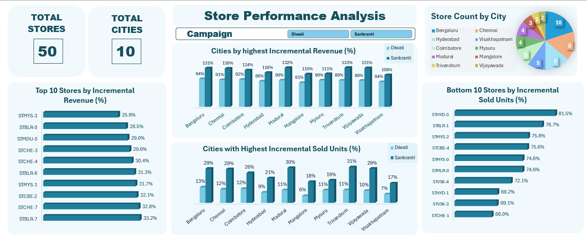
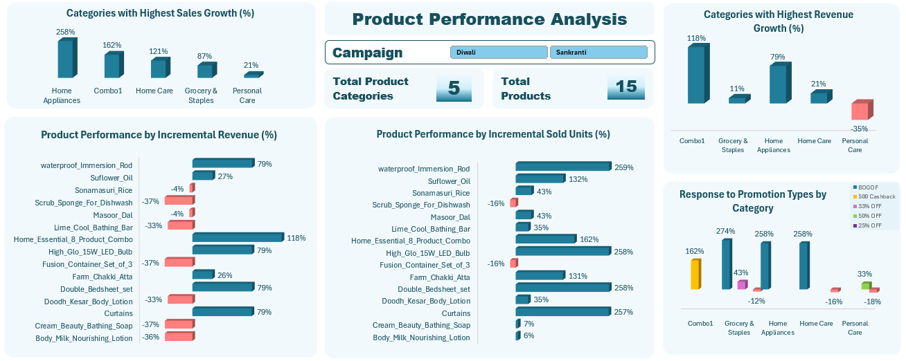
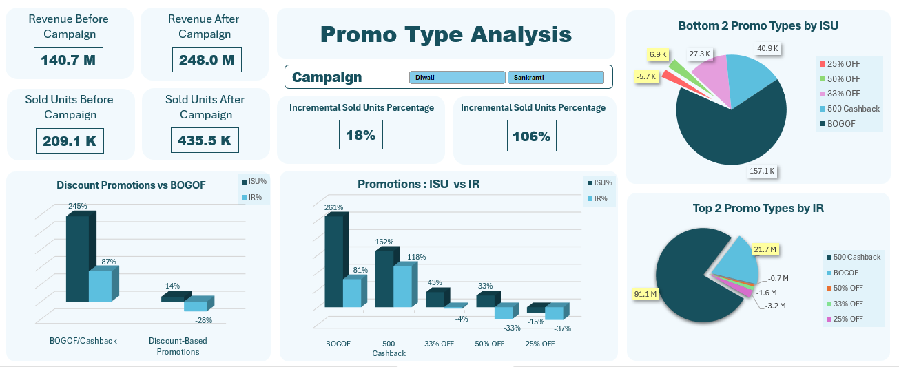

# Atliq Promotion Sales Analysis

## 📌 Project Overview
This project is part of the **Codebasics Resume Challenge**, where I performed a detailed **Promotional Sales Analysis** for **Atliq** using **Excel**. The analysis aims to evaluate the impact of different promotional strategies on product and store performance, helping the business optimize future marketing campaigns. The project involves raw data processing, pivot table analysis, and dashboard visualizations.


## Repository Structure
```
Atliq_Promotion_Sales (Excel)
│-- 📂 Data
│   ├── dim_campaigns.csv  
│   ├── dim_products.csv  
│   ├── dim_stores.csv  
│   ├── fact_events.csv  
│
│-- 📂 Excel_Workbook
│   ├── Atliq pivot tables.pdf  
│   ├── atliq promotion sales dashboards.xlsx  
│
│-- 📂 Dashboards
│   ├── Store_Performance.png  
│   ├── Product_Analysis.png  
│   ├── Promotion_Impact.png  
│   ├── All_Dashboards_Combined.pdf  
│
│-- 📂 Business_Objectives
│   ├── Recommended_insights.pdf  
│   ├── Business_requests.pdf  
│
│-- 📜 README.md  
```

---

## 🔍 Data Description
- **dim_campaigns.csv**: Contains details about different promotional campaigns (campaign ID, start & end date, type, etc.).
- **dim_products.csv**: Includes product-related information such as product ID, name, category, and brand.
- **dim_stores.csv**: Provides store-specific details like store ID, location, and size.
- **fact_events.csv**: The core transactional data, including sales, promotions, and revenue.

---

## 🎯 Business Objectives  
This project aims to answer critical business questions related to **store performance, product performance, and promotional effectiveness.**
- **Store Performance:** Identify high-performing stores and reasons behind their success.  
- **Product Performance:** Analyze which products contribute the most to revenue.  
- **Promotion Impact:** Evaluate how promotions influence sales and revenue.

--- 
**Below are the key dashboards providing insights into store performance, product trends, and promotional effectiveness.**
## 📊 Store Performance Analysis

## 🛒 Product Performance Analysis

## 🎯 Promo Type Performance Analysis


---

## Key Insights  

### **Promo Type Performance**  
- **BOGOF (261% ISU, 81% IR) and ₹500 Cashback (162% ISU, 118% IR) were the most effective promotions.**  
- **Discount-based promotions (25% OFF, 50% OFF) underperformed, showing minimal or negative impact.**  
- **Revenue surged from ₹140.7M to ₹248.0M, and sold units more than doubled (209.1K → 435.5K).**  
- **Sankranti promotions (106% ISU) outperformed Diwali (18% ISU), indicating stronger consumer response.**  
- **Future campaigns should prioritize BOGOF and Cashback while reconsidering deep discounts.**  

### **Product Performance**  
- **Home Appliances (258%) and Combo Offers (162%) saw the highest sales growth.**  
- **Revenue growth leaders: Combo Offers (118%) and Home Appliances (79%), while Personal Care declined (-35%).**  
- **Top products by Incremental Revenue (IR%):** Home Essential Combo (118%), Waterproof Immersion Rod (79%), Curtains (79%).  
- **Top products by Incremental Sold Units (ISU%):** Waterproof Immersion Rod (259%), High Glo LED Bulb (258%), Curtains (257%).  
- **BOGOF and ₹500 Cashback drove the highest ISU (274% in Combo Offers, 258% in Home Appliances), while discount-based promotions showed mixed or negative results.**  

### **Store Performance**  
- **Top cities by Incremental Revenue (IR%): Bengaluru (131%), Chennai (130%), Visakhapatnam lowest (108%).**  
- **Highest Incremental Sold Units (ISU%):** Madurai (30%), Vijayawada (31%), Chennai (29%).  
- **Top-performing stores (IR%):** STBLR-7 (33.2%), STCHE-7 (32.8%), STCBE-2 (32.1%).  
- **Lowest ISU stores:** STHYD-3 (81.5%), STBLR-1 (78.7%), STCBE-4 (75.6%), indicating underperformance despite promotions.  
- **Sankranti promotions outperformed Diwali across most cities, reflecting stronger consumer engagement.**  


---

## 🛠 Tools & Techniques Used
- **Excel**: Data cleaning, transformation, pivot tables, and dashboard creation.
- **Pivot Tables**: Used for aggregating and analyzing large datasets.
- **Data Visualization**: Created impactful charts and dashboards to showcase insights.

---

## 🚀 How to Use This Repository  
1. **Download the repository** or clone it using:  
   ```sh  
   git clone <(https://github.com/Joti-Sukheja/Atliq-Promotion-Sales)>  
   ```  
2. Open `atliq promotion sales dashboards.xlsx` to explore the data and dashboards.  
3. Refer to **Business_Objectives/** for key questions and recommended insights.  
4. Analyze **Dashboards/** for graphical representations of findings.  
5. Modify pivot tables in Excel for further analysis.  
---

## 🏆 Project Impact
This analysis helps Atliq:
- Optimize **future promotional strategies**.
- Identify the **best-performing products and stores**.
- Allocate budgets to **high-ROI campaigns**.
- Avoid **low-impact promotional activities**.

---

##  Conclusion
This project showcases how **Excel-based data analysis** can drive business decisions. By analyzing promotional campaigns, I provided **actionable insights** that help Atliq enhance its marketing strategies and maximize revenue.

---

## 📜 License

This project is licensed under the MIT License. Feel free to use, modify, and distribute it as needed.

---

## 🤝 Connect with Me
If you're interested in discussing this project or data analysis in general, feel free to connect with me on **LinkedIn** or check out my **GitHub** for more projects!

🔗 **LinkedIn**: [LinkedIn/joti-sukheja](www.linkedin.com/in/joti-sukheja)
🔗 **GitHub**: [GitHub/joti-sukheja](https://github.com/Joti-Sukheja)
